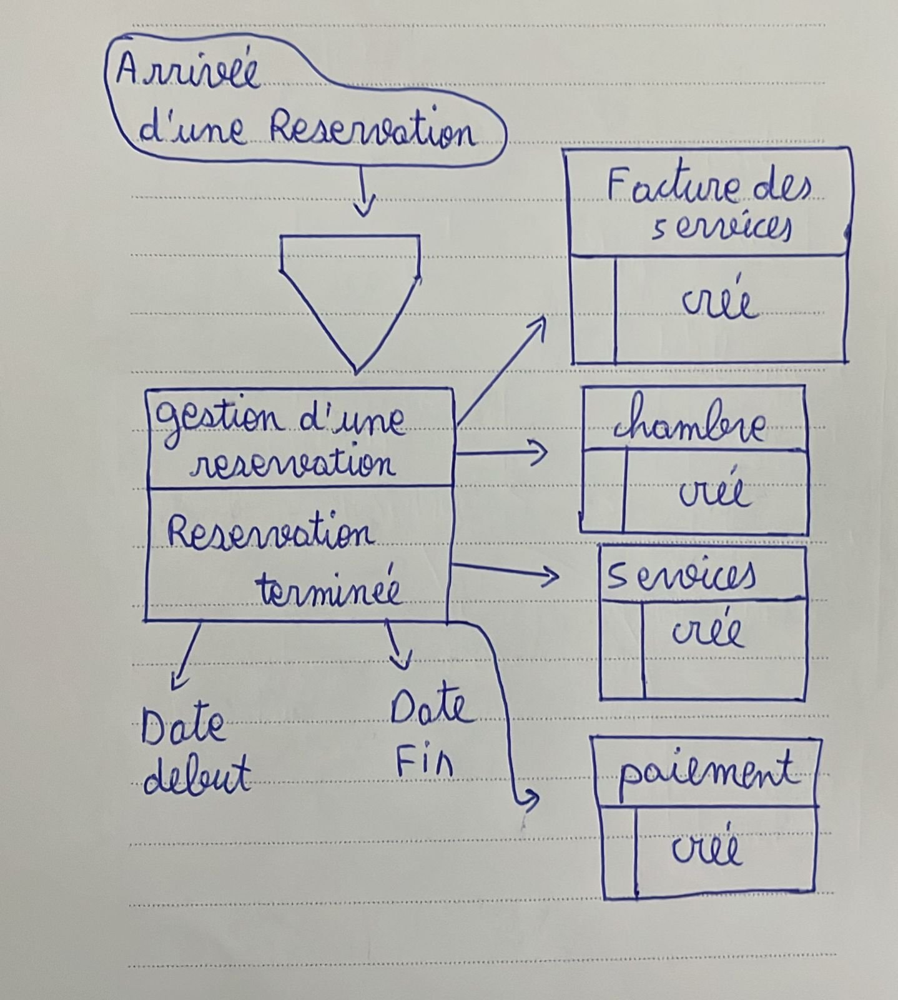
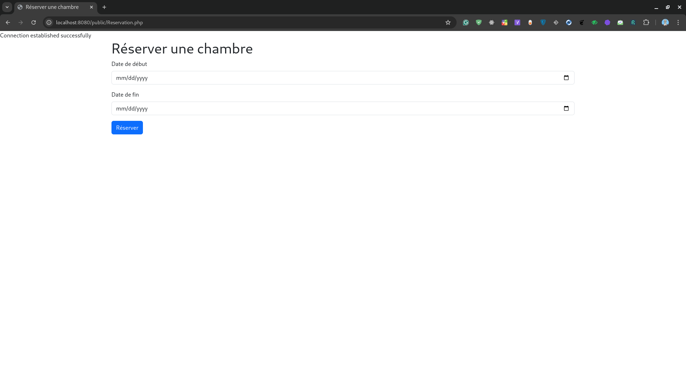

# Conception d'un système de réservation pour un Riad

## Table des matières

- [Partie 1 : Cahier des charges](#partie-1--cahier-des-charges)
  - [Contexte et Objectifs du Projet](#contexte-et-objectifs-du-projet)
  - [Entités principales](#entités-principales)
  - [Associations](#associations)
  - [Entités secondaires](#entités-secondaires)
  - [Associations secondaires](#associations-secondaires)
  - [Fonctionnalités](#fonctionnalités)
  - [Contraintes](#contraintes)
    - [Contraintes de client](#contraintes-de-client)
    - [Contraintes de chambre](#contraintes-de-chambre)
    - [Contraintes de réservation](#contraintes-de-réservation)
    - [Contraintes de paiement](#contraintes-de-paiement)
    - [Contraintes de facture](#contraintes-de-facture)
    - [Contraintes de service supplémentaire](#contraintes-de-service-supplémentaire)
  - [MCD (Modèle Conceptuel de Données)](#mcd-modèle-conceptuel-de-données)
  - [MLD (Modèle Logique de Données)](#mld-modèle-logique-de-données)
  - [SQL - Oracle](#sql---oracle)
- [Partie 2 : MCTA (Modèle conceptuel de traitement analytique)](#partie-2--mcta-modèle-conceptuel-de-traitement-analytique)
- [Partie 3 : CVO (Cycle de vie d'un objet)](#partie-3--cvo-cycle-de-vie-dun-objet)
- [Partie 4 : Programmation Orientée Objet](#partie-4--programmation-orientée-objet)
  - [Objectifs](#objectifs)
  - [Structure du Projet](#structure-du-projet)
  - [Les Classes](#les-classes)
  - [Les Vues](#les-vues)
  - [La Base de Données](#la-base-de-données)
  - [Les Scripts](#les-scripts)
  - [Les Diagrammes](#les-diagrammes)

# Partie 1 : Cahier des charges

## Contexte et Objectifs du Projet

Ce projet a pour objectif de concevoir et développer un système de réservation efficace et intuitif pour les chambres d'un Riad. Ce système permettra de simplifier la gestion des clients, des réservations, des paiements et des services supplémentaires. Le Riad pourra ainsi offrir une expérience de réservation moderne, fiable et adaptée aux besoins spécifiques de sa clientèle.

## Entités principales

- **Client :** Informations sur les clients (id_client, nom, prénom, adresse, téléphone, email, passport_id, cin_id).
- **Chambre :** Détails sur les chambres disponibles (numéro, type, tarif, état).
- **Réservation :** Informations sur les réservations (numéro, date début, date fin, statut).
- **Paiement :** Informations sur les paiements effectués (montant, mode de paiement, date).

## Associations

- **Client-Réservation :** Un client peut faire plusieurs réservations, mais une réservation appartient à un seul client.
- **Réservation-Chambre :** Une réservation peut concerner plusieurs chambres.
- **Réservation-Paiement :** Une réservation peut avoir un ou plusieurs paiements associés.

## Entités secondaires

- **Facture :** Informations sur les factures (id_facture, date_emission, montant, id_reservation).
- **Service supplémentaire :** Informations sur les services supplémentaires (id_service, nom, tarif, description, id_reservation).
- **Service supplémentaire facturé :** Informations sur les services supplémentaires facturés (id_service, id_facture).

## Associations secondaires

- **Facture-Réservation :** Une facture est associée à une seule réservation.
- **Service supplémentaire-Réservation :** Un service supplémentaire peut être associé à plusieurs réservations.
- **Service supplémentaire facturé-Facture :** Un service supplémentaire facturé est associé à une seule facture.

## Fonctionnalités

- **Gestion des clients :** Ajouter, modifier, supprimer un client.
- **Gestion des chambres :** Ajouter, modifier, supprimer une chambre.
- **Gestion des réservations :** Ajouter, modifier, supprimer une réservation.
- **Gestion des paiements :** Ajouter, modifier, supprimer un paiement.
- **Gestion des factures :** Ajouter, modifier, supprimer une facture.
- **Gestion des services supplémentaires :** Ajouter, modifier, supprimer un service supplémentaire.

## Contraintes

### Contraintes de client

- Un client doit avoir un email unique.
- Un client doit avoir un passport_id ou cin_id.
- Un client doit avoir un numéro de téléphone unique.
- Un client doit avoir un nom et un prénom.

### Contraintes de chambre

- Une chambre doit avoir un numéro unique.
- Une chambre doit avoir un type.
- Une chambre doit avoir un tarif.
- Une chambre doit avoir un état (disponible, occupée, en maintenance).

### Contraintes de réservation

- Une réservation doit avoir un numéro unique.
- Une réservation doit avoir une date de début et une date de fin.
- Une réservation doit avoir un statut (confirmée, annulée, en attente).

### Contraintes de paiement

- Un paiement doit avoir un montant.
- Un paiement doit avoir un mode de paiement.
- Un paiement doit avoir une date.

### Contraintes de facture

- Une facture doit avoir un montant.
- Une facture doit avoir une date d'émission.

### Contraintes de service supplémentaire

- Un service supplémentaire doit avoir un nom.
- Un service supplémentaire doit avoir un tarif.
- Un service supplémentaire doit avoir une description.
- Un service supplémentaire doit être associé à une réservation.

## MCD (Modèle Conceptuel de Données)


## MLD (Modèle Logique de Données)

- **ASSOCIER_SERVICE_FACTURE** (<u>_#id_service_</u>, <u>_#id_facture_</u>)
  - Le champ **id_service** fait partie de la clé primaire de la table. C'est une clé étrangère qui a migré directement à partir de l'entité _SERVICE_SUPPLEMENTAIRE_FACTURE_.
  - Le champ **id_facture** fait partie de la clé primaire de la table. C'est une clé étrangère qui a migré directement à partir de l'entité _FACTURE_.
- **ASSOCIER_SERVICE_RESERVATION** (<u>_#id_service_</u>, <u>_#id_reservation_</u>)

  - Le champ **id_service** fait partie de la clé primaire de la table. C'est une clé étrangère qui a migré directement à partir de l'entité _SERVICE_SUPPLEMENTAIRE_.
  - Le champ **id_reservation** fait partie de la clé primaire de la table. C'est une clé étrangère qui a migré directement à partir de l'entité _RESERVATION_.

- **CHAMBRE** (<u>id_chambre</u>, type, tarif, état)
  - Le champ **id_chambre** constitue la clé primaire de la table. C'était déjà un identifiant de l'entité _CHAMBRE_.
  - Les champs type, tarif et état étaient déjà de simples attributs de l'entité _CHAMBRE_
- **CLIENT** (<u>id*client</u>, nom, prénom, adresse, téléphone, email, passport_id, cin_id, *#id*reservation!*)

  - Le champ **id_client** constitue la clé primaire de la table. C'était déjà un identifiant de l'entité _CLIENT_.
  - Les champs nom, prénom, adresse, téléphone, email, passport*id et cin_id étaient déjà de simples attributs de l'entité \_CLIENT*.
  - Le champ **id_reservation** est une clé étrangère. Il a migré par l'association de dépendance fonctionnelle FAIRE à partir de l'entité _RESERVATION_ en perdant son caractère identifiant.

- **CONCERNE** (<u>_#id_reservation_</u>, <u>_#id_chambre_</u>)

  - Le champ **id_reservation** fait partie de la clé primaire de la table. C'est une clé étrangère qui a migré directement à partir de l'entité _RESERVATION_.
  - Le champ **id_chambre** fait partie de la clé primaire de la table. C'est une clé étrangère qui a migré directement à partir de l'entité _CHAMBRE_.

- **FACTURE** (<u>id*facture</u>, date_emission, montant, id_reservation 1, *#id*reservation 2!*)

  - Le champ **id_facture** constitue la clé primaire de la table. C'était déjà un identifiant de l'entité _FACTURE_.
  - Les champs date*emission, montant et **id_reservation** 1 étaient déjà de simples attributs de l'entité \_FACTURE*.
  - Le champ **id_reservation** 2 est une clé étrangère. Il a migré par l'association de dépendance fonctionnelle _ASSOCIER_FACTURE_ à partir de l'entité _RESERVATION_ en perdant son caractère identifiant.

- **PAIEMENT** (<u>id_paiement</u>, montant, mode_paiement, date)

  - Le champ **id_paiement** constitue la clé primaire de la table. C'était déjà un identifiant de l'entité _PAIEMENT_.
  - Les champs montant, mode*paiement et date étaient déjà de simples attributs de l'entité \_PAIEMENT*.

- **RESERVATION** (<u>id*reservation</u>, date_debut, date_fin, statut, *#id*paiement!*)
  - Le champ **id_reservation** constitue la clé primaire de la table. C'était déjà un identifiant de l'entité _RESERVATION_.
  - Les champs date*debut, date_fin et statut étaient déjà de simples attributs de l'entité \_RESERVATION*.
  - Le champ **id_paiement** est une clé étrangère. Il a migré par l'association de dépendance fonctionnelle ASSOCIER*PAIEMENT à partir de l'entité \_PAIEMENT* en perdant son caractère identifiant.
- **SERVICE_SUPPLEMENTAIRE** (<u>id_service</u>, nom, tarif, description, id_reservation)

  - Le champ **id_service** constitue la clé primaire de la table. C'était déjà un identifiant de l'entité _SERVICE_SUPPLEMENTAIRE_.
  - Les champs nom, tarif, description et id*reservation étaient déjà de simples attributs de l'entité \_SERVICE_SUPPLEMENTAIRE*.

- **SERVICE_SUPPLEMENTAIRE_FACTURE** (<u>id_service</u>, id_facture)
  - Le champ **id_service** constitue la clé primaire de la table. C'était déjà un identifiant de l'entité _SERVICE_SUPPLEMENTAIRE_FACTURE_.
  - Le champ **id_facture** était déjà un simple attribut de l'entité _SERVICE_SUPPLEMENTAIRE_FACTURE_.

## SQL - Oracle

```sql
-- Table for CLIENT
CREATE TABLE IF NOT EXISTS CLIENT (
  id_client VARCHAR2(255) DEFAULT SYS_GUID() NOT NULL,
  nom VARCHAR2(255) NOT NULL,
  prenom VARCHAR2(255) NOT NULL,
  adresse VARCHAR2(255),
  telephone VARCHAR2(255) NOT NULL UNIQUE,
  email VARCHAR2(255) NOT NULL UNIQUE,
  hashed_password VARCHAR2(255) NOT NULL,
  passport_id VARCHAR2(255) UNIQUE,
  cin_id VARCHAR2(255) UNIQUE,
  CONSTRAINT pk_client PRIMARY KEY (id_client)
);


-- Table for RESERVATION
CREATE TABLE IF NOT EXISTS RESERVATION (
  id_reservation VARCHAR2(255) DEFAULT SYS_GUID() NOT NULL,
  date_debut DATE NOT NULL,
  date_fin DATE NOT NULL,
  statut VARCHAR2(255) CHECK (statut IN ('confirmée', 'annulée', 'en attente')) NOT NULL,
  id_client VARCHAR2(255) NOT NULL,
  CONSTRAINT pk_reservation PRIMARY KEY (id_reservation),
  CONSTRAINT fk_reservation_client FOREIGN KEY (id_client) REFERENCES CLIENT (id_client) ON DELETE CASCADE
);


CREATE TABLE IF NOT EXISTS PAIEMENT (
  id_paiement VARCHAR2(255) DEFAULT SYS_GUID() NOT NULL,
  montant NUMBER(10, 2),
  mode_paiement VARCHAR2(255) CHECK (mode_paiement IN ('cash', 'card', 'bank transfer')) NOT NULL,
  paiement_date DATE,
  id_reservation VARCHAR2(255) NOT NULL,
  CONSTRAINT pk_paiement PRIMARY KEY (id_paiement),
  CONSTRAINT fk_paiement_reservation FOREIGN KEY (id_reservation) REFERENCES RESERVATION (id_reservation) ON DELETE CASCADE
);


-- Table for CHAMBRE
CREATE TABLE IF NOT EXISTS CHAMBRE (
  id_chambre VARCHAR2(255) NOT NULL,
  type VARCHAR2(255) NOT NULL,
  tarif NUMBER(10, 2) NOT NULL,
  etat VARCHAR2(255) CHECK (etat IN ('disponible', 'occupée', 'en maintenance')) NOT NULL,
  CONSTRAINT pk_chambre PRIMARY KEY (id_chambre)
);

-- Table for SERVICE_SUPPLEMENTAIRE
CREATE TABLE IF NOT EXISTS SERVICE_SUPPLEMENTAIRE (
  id_service VARCHAR2(255) DEFAULT SYS_GUID() NOT NULL,
  nom VARCHAR2(255) NOT NULL,
  tarif NUMBER(10, 2) NOT NULL,
  description VARCHAR2(255),
  id_reservation VARCHAR2(255),
  CONSTRAINT pk_service_supp PRIMARY KEY (id_service),
  CONSTRAINT fk_service_supp_reserv FOREIGN KEY (id_reservation) REFERENCES RESERVATION (id_reservation) ON DELETE CASCADE
);

-- Table for FACTURE
CREATE TABLE IF NOT EXISTS FACTURE (
  id_facture VARCHAR2(255) DEFAULT SYS_GUID() NOT NULL,
  date_emission DATE,
  montant NUMBER(10, 2),
  id_reservation VARCHAR2(255) NOT NULL,
  CONSTRAINT pk_facture PRIMARY KEY (id_facture),
  CONSTRAINT fk_facture_reserv FOREIGN KEY (id_reservation) REFERENCES RESERVATION (id_reservation) ON DELETE CASCADE
);

-- Table for CONCERNE
CREATE TABLE IF NOT EXISTS CONCERNE (
  id_reservation VARCHAR2(255) NOT NULL,
  id_chambre VARCHAR2(255) NOT NULL,
  CONSTRAINT pk_concerne PRIMARY KEY (id_reservation, id_chambre),
  CONSTRAINT fk_concerne_reserv FOREIGN KEY (id_reservation) REFERENCES RESERVATION (id_reservation) ON DELETE CASCADE,
  CONSTRAINT fk_concerne_chambre FOREIGN KEY (id_chambre) REFERENCES CHAMBRE (id_chambre) ON DELETE CASCADE
);


-- Table for ASSOCIER_SERVICE_FACTURE
CREATE TABLE IF NOT EXISTS ASSOCIER_SERVICE_FACTURE (
  id_service VARCHAR2(255) DEFAULT SYS_GUID() NOT NULL,
  id_facture VARCHAR2(255) NOT NULL,
  CONSTRAINT pk_assoc_service_fact PRIMARY KEY (id_service, id_facture),
  CONSTRAINT fk_assoc_service_fact_fact FOREIGN KEY (id_facture) REFERENCES FACTURE (id_facture) ON DELETE CASCADE,
  CONSTRAINT fk_assoc_service_fact_serv FOREIGN KEY (id_service) REFERENCES SERVICE_SUPPLEMENTAIRE (id_service) ON DELETE CASCADE
);

-- Table for ASSOCIER_SERVICE_RESERVATION
CREATE TABLE IF NOT EXISTS ASSOCIER_SERVICE_RESERVATION (
  id_service VARCHAR2(255) DEFAULT SYS_GUID() NOT NULL,
  id_reservation VARCHAR2(255) NOT NULL,
  CONSTRAINT pk_assoc_service_reserv PRIMARY KEY (id_service, id_reservation),
  CONSTRAINT fk_assoc_service_reserv_reserv FOREIGN KEY (id_reservation) REFERENCES RESERVATION (id_reservation) ON DELETE CASCADE,
  CONSTRAINT fk_assoc_service_reserv_serv FOREIGN KEY (id_service) REFERENCES SERVICE_SUPPLEMENTAIRE (id_service) ON DELETE CASCADE
);
```

# Partie 2 : MCTA (Modèle conceptuel de traitement analytique)

<center>




</center>

# Partie 3 : CVO (Cycle de vie d'un objet)

<center>


</center>

# Partie 4 : Programmation Orientée Objet

## Objectifs

L'objectif de cette partie est de développer une application web pour la gestion des réservations d'un Riad en appliquant le paradigme de la programmation orientée objet (POO). Les principales étapes incluent :

- **Développement** : Créer une application web fonctionnelle.
- **Technologies** : Utiliser PHP pour le backend et Oracle pour la gestion des données.
- **Conception** : Concevoir des classes représentant les entités principales et secondaires.
- **Fonctionnalités** : Implémenter des méthodes pour gérer les fonctionnalités de l'application.
- **Interface** : Développer des vues conviviales pour les utilisateurs.

---

## 1. Structure du Projet

```
.
├── config
│   ├── database.sql
│   ├── db.php
│   └── drop.sql
├── diagrams
│   ├── cvo_10.jpeg
│   ├── cvo_11.jpeg
│   ├── cvo_12.jpeg
│   ├── cvo_13.jpeg
│   ├── cvo_1.jpeg
│   ├── cvo_2.jpeg
│   ├── cvo_3.jpeg
│   ├── cvo_4.jpeg
│   ├── cvo_5.jpeg
│   ├── cvo_6.jpeg
│   ├── cvo_7.jpeg
│   ├── cvo_8.jpeg
│   ├── cvo_9.jpeg
│   ├── mcta_1.jpeg
│   ├── mcta_2.jpeg
│   ├── mcta_3.jpeg
│   └── mcta_4.jpeg
├── docker-compose.yaml
├── image.png
├── model
│   ├── admin.php
│   ├── Chambres.php
│   ├── Client.php
│   ├── Concerne.php
│   ├── Paiement.php
│   └── Reservation.php
├── public
│   ├── admin_signup.php
│   ├── admin_view.php
│   ├── approuver.php
│   ├── chambre.php
│   ├── client_view.php
│   ├── index.php
│   ├── infoPersonnelles.php
│   ├── login.php
│   └── Reservation.php
└── README.md

5 directories, 38 files

```

---

## 2. Les Classes

Les classes et leurs méthodes associées sont disponibles dans le dossier [`model`](./model). Voici une brève description des principales entités :

- **Admin** : Gestion des utilisateurs administrateurs.
- **Chambres** : Représentation et gestion des chambres du Riad.
- **Client** : Gestion des informations des clients.
- **Concerne** : Liaison entre réservations et chambres.
- **Paiement** : Gestion des transactions de paiement.
- **Reservation** : Gestion des réservations des chambres.

---

## 3. Les Vues

Les vues de l'application sont accessibles dans le dossier [`public`](./public). Les principales fonctionnalités incluent :

### Création de Compte et Connexion

L'utilisateur peut créer un compte et se connecter pour accéder à son espace personnel.

  
<p style="text-align: center;">Informations personnelles</p>

### Réservation de Chambre

Cette fonctionnalité permet à l'utilisateur de réserver une chambre en sélectionnant une date de début et une date de fin.

  
<p style="text-align: center;">Réservation</p>

### Gestion des Réservations

La gestion des réservations varie selon le rôle de l'utilisateur :

- **Administrateur** : Approber ou rejeter les réservations.
- **Client** : Consulter ses réservations.

  
  
<p style="text-align: center;">Page d'accueil</p>

---

## 4. La Base de Données

Les scripts et configurations pour la base de données Oracle sont disponibles dans le dossier [`config`](./config). Les fichiers incluent :

- **`database.sql`** : Script de création des tables.
- **`db.php`** : Configuration de connexion à la base de données.
- **`drop.sql`** : Script pour supprimer les tables.

---

## 5. Les Scripts

Les scripts utilisés pour les opérations de la base de données se trouvent également dans le dossier [`config`](./config).

---

## 6. Les Diagrammes

Les diagrammes UML et autres illustrations utiles pour comprendre le système sont disponibles dans le dossier [`diagrams`](./diagrams).

---
